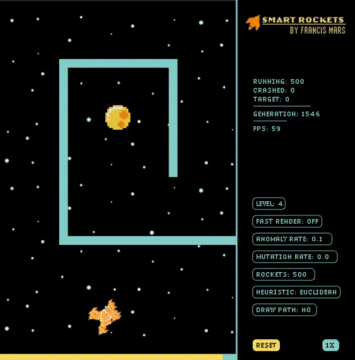

# Smart Rockets V1

Smart Rockets is a 0-player game that uses Genetic Alghoritms to optimize for the path between an Initial Point and a Target. There is a population of Rockets that can move freely in space during a time cycle, attempting to find the Target. The first generation starts with random DNA, which are instructions for the acceleration, therefore velocity and trajectory, that the rocket will perform during its life cycle. After the lifespan, a fitness calculating function is applied to the population in order to select the two rockets that finished closer (or, in case of a tie, faster) to the target, which will be selected for reproduction. The reproduction process is done by crossing over the DNA of the two progenitors, with the possibility of random mutations and genetic anomalies. With the assistance of an heuristic function, the new generation will likely increase its performance compared to the previous one, possibly leading to optimum performance after many generations.

  

On the left, there is the main canvas of the game, where the rockets can move freely. The rockets become translucent when they hit an obstacle or the wall. The target has a blinking effect in order to grab the user's attention. The rocket's propulsor has different sizes according to the rocket's velocity. The walls and obstacles are in greenish blue. There is a time bar in the bottom in orange that becomes shorter with time. The user can move the targets by clicking on an existing obstacle and holding while moving, can create an obstacle by clicking on an empty space and dragging the mouse and can remove obstacles by right clicking on an existing target. The user can also change the location of the target. On the right, it’s the GUI. On the top it displays relevant information and on the bottom there are the buttons the user can interact with to change the options. 

## Running Instructions:
Install Processing -> https://processing.org/

Download this Repository

Open with Processing

Press Play :)
